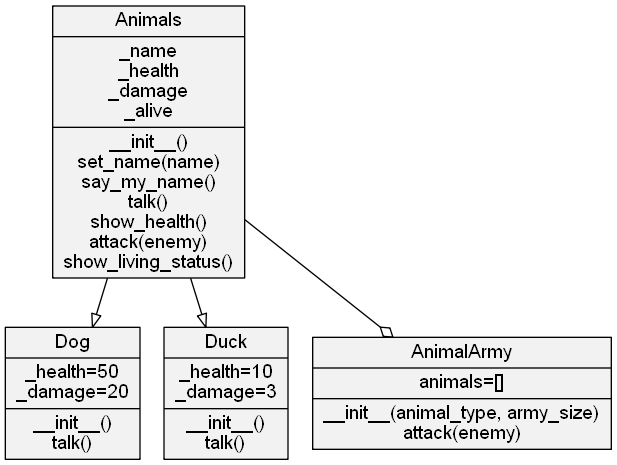

# PythonOOPexample

## 1. Animal fighting game Example

This is a simple fun example of Object Oriented programming in Python that
I have used for introduction trainings to OOP.

During the training, we will do a little game with animals fighting.

We will learn what inheritance means and how it works.
Here the basic inheritance concept graph:


The class diagram of our classes is :




The output of our main script will be:

```

Init a new Animal
Init a new Dog
My name is Scooby Doo
*** WOOOFFF!!!!!!! ***
Scooby Doo's health is 50


Init a new Animal
Init a new Dog
My name is Fido
*** WOOOFFF!!!!!!! ***
Fido's health is 50


Init a new Animal
Init a new Duck
My name is Ducky
*** KWACK!!! ***
Ducky's health is 10


Ducky attacks Fido
Fido's health is 47
Fido is alive!!!!
Ducky attacks Fido
Fido's health is 44
Fido is alive!!!!
Ducky attacks Fido
Fido's health is 41
Fido is alive!!!!
Ducky attacks Fido
Fido's health is 38
Fido is alive!!!!
Ducky attacks Fido
Fido's health is 35
Fido is alive!!!!
Ducky attacks Fido
Fido's health is 32
Fido is alive!!!!
Ducky attacks Fido
Fido's health is 29
Fido is alive!!!!
Ducky attacks Fido
Fido's health is 26
Fido is alive!!!!
Ducky attacks Fido
Fido's health is 23
Fido is alive!!!!
Ducky attacks Fido
Fido's health is 20
Fido is alive!!!!
Ducky attacks Fido
Fido's health is 17
Fido is alive!!!!
Ducky attacks Fido
Fido's health is 14
Fido is alive!!!!
Ducky attacks Fido
Fido's health is 11
Fido is alive!!!!
Ducky attacks Fido
Fido's health is 8
Fido is alive!!!!
Ducky attacks Fido
Fido's health is 5
Fido is alive!!!!
Ducky attacks Fido
Fido's health is 2
Fido is alive!!!!
Ducky attacks Fido
Fido's health is 0
Fido is DEAD !!!! ... :-(


Scooby Doo attacks Ducky
Ducky's health is 0


Init a new Animal
Init a new Duck
Init a new Animal
Init a new Duck
Init a new Animal
Init a new Duck
Init a new Animal
Init a new Duck
Init a new Animal
Init a new Duck
Init a new Animal
Init a new Duck
Init a new Animal
Init a new Duck
Init a new Animal
Init a new Duck
Init a new Animal
Init a new Duck
Init a new Animal
Init a new Duck
Army of 10 ducks created!


Army attack on Scooby Doo
duck0 attacks Scooby Doo
Scooby Doo's health is 47
duck1 attacks Scooby Doo
Scooby Doo's health is 44
duck2 attacks Scooby Doo
Scooby Doo's health is 41
duck3 attacks Scooby Doo
Scooby Doo's health is 38
duck4 attacks Scooby Doo
Scooby Doo's health is 35
duck5 attacks Scooby Doo
Scooby Doo's health is 32
duck6 attacks Scooby Doo
Scooby Doo's health is 29
duck7 attacks Scooby Doo
Scooby Doo's health is 26
duck8 attacks Scooby Doo
Scooby Doo's health is 23
duck9 attacks Scooby Doo
Scooby Doo's health is 20


Scooby Doo is alive!!!!
*** WOOOFFF!!!!!!! ***
*** WOOOFFF!!!!!!! ***
*** WOOOFFF!!!!!!! ***
```


## 2. ORM Example/introduction

Now we know how to build objects and collection of objects (with the animal army), this will help us undertand the ORM technique.

Here is the definition of ORM from Wikipedia (https://en.wikipedia.org/wiki/Object-relational_mapping):

*"Object-relational mapping (ORM, O/RM, and O/R mapping tool) in computer science is a programming technique for converting data between incompatible type systems using object-oriented programming languages. This creates, in effect, a "virtual object database" that can be used from within the programming language."*

So, in other words, ORM is just a "mapping" of a DB to an OOP model.

We are going to do that with one table as an example.

Let's consider a "Users" table:


This would be our table and columns in our database. For the sake of code simplicity, we will just store data in a CSV file and load it to an simple ORM representation. In the future, we could have different "connectors" and load data from a DB instead of a CSV file, and our OOP/ORM code would just stay the same.

In our ORM model, the class diagram will look like this:


We have a "User" class representing heach row; and a "UserCollection" class representing the "Users" table (a table is a collection of rows.)

You can run the main_orm.py script and see what is happening.
